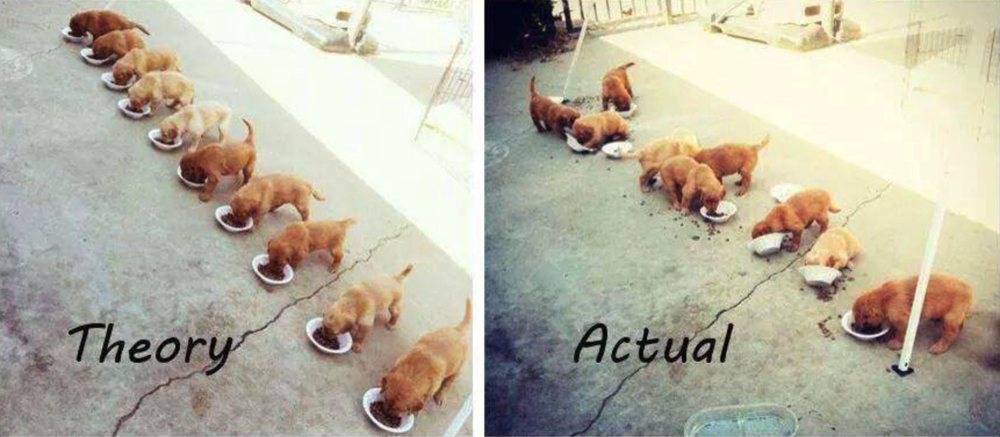

多くのブログ記事では、`componentDidMount`や`useEffect`、Redux、Apolloなどを使用したReactアプリでのAPI/非同期データの読み込みについて語られています。

しかし、これらの記事は**一般的に楽観的**で、考慮すべき重要な点に触れていません。競合状態が発生し、UIが**不整合な状態**になる可能性があるのです。

🔗 [**続きを読む**](https://sebastienlorber.com/handling-api-request-race-conditions-in-react)